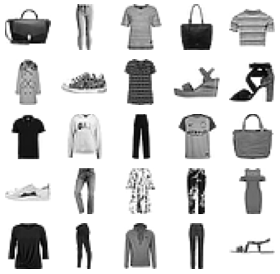
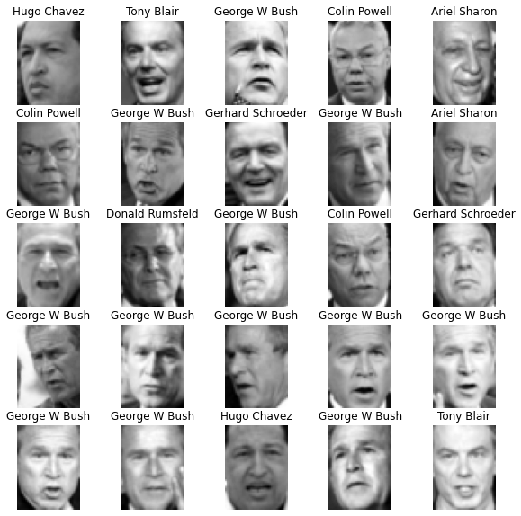

# Classification algorithms

## Jupyter notebooks
- [Classification of handwritten digits](https://github.com/sebastiancoombs/Sebs-Data-Science-Skills/blob/main/Classification/Classification%20of%20handwritten%20digits.ipynb)
- [Clothing and Face Image Classification](https://github.com/sebastiancoombs/Sebs-Data-Science-Skills/blob/main/Classification/Mnist%20Faces%20and%20penguins.ipynb)
- [Predicting heart disease](https://github.com/sebastiancoombs/Sebs-Data-Science-Skills/blob/main/Classification/Predicting%20heart%20disease.ipynb)
- [Linguistic street map of Singapore](https://github.com/sebastiancoombs/Sebs-Data-Science-Skills/blob/main/Classification/Linguistic%20street%20map%20of%20Singapore.ipynb)
- [Spam dectetion](https://github.com/sebastiancoombs/Sebs-Data-Science-Skills/blob/main/Classification/Email%20Spam%20Detection.ipynb)
