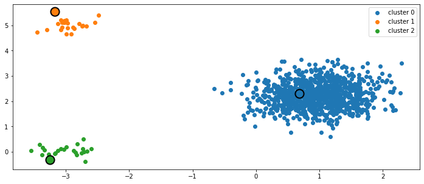

# Clustering Algorithms

## Jupyter notebooks

- [Clustering Flowers, Irises, and Penguins.ipynb](https://github.com/sebastiancoombs/Sebs-Data-Science-Skills/blob/main/Clustering/Clustering%20Flowers%20irises%20and%20penguins.ipynb)

- [Clustering for Image Color Segmentation](https://github.com/sebastiancoombs/Sebs-Data-Science-Skills/blob/main/Clustering/Clustering%20for%20Color%20Segmentation.ipynb)
- [Clustering Senators based on votes](https://github.com/sebastiancoombs/Sebs-Data-Science-Skills/blob/main/Clustering/Clustering%20senators.ipynb)
- [Exponentially Weighted k-Nearest Neighbors](https://github.com/sebastiancoombs/Sebs-Data-Science-Skills/blob/main/Clustering/Exponentially%20Weighted%20k-Nearest%20Neighbors.ipynb)
- [Greedy Initialization of k-means](https://github.com/sebastiancoombs/Sebs-Data-Science-Skills/blob/main/Clustering/Greedy%20Initialization%20of%20k-means.ipynb)
- [Top-down Hierarchical clustering](https://github.com/sebastiancoombs/Sebs-Data-Science-Skills/blob/main/Clustering/Top-down%20hierarchical%20clustering.ipynb)
- [k-means vs Hierarchical clustering](https://github.com/sebastiancoombs/Sebs-Data-Science-Skills/blob/main/Clustering/kmeans%20vs%20hierarchical%20clustering.ipynb)
