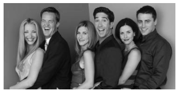
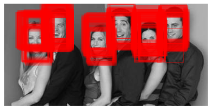

# Deep Learning and Computer vision algorithms

  
  

## Jupyter notebooks

- [Simple Neural Net (tensorflow), digit classifier](https://github.com/sebastiancoombs/Sebs-Data-Science-Skills/blob/main/Deep%20Learning/Artificial%20Neural%20Networks.ipynb)

- [Convolutional Nueral Net, image classifier](https://github.com/sebastiancoombs/Sebs-Data-Science-Skills/blob/main/Deep%20Learning/Convoutional%20Nueral%20network.ipynb)

- [Simple Face Detector](https://github.com/sebastiancoombs/Sebs-Data-Science-Skills/blob/main/Deep%20Learning/Simple%20Face%20Detector.ipynb)

- [LDA for Facial expression Recognition](https://github.com/sebastiancoombs/Sebs-Data-Science-Skills/blob/main/Deep%20Learning/LDA%20for%20face%20expression%20recognition.ipynb)

- [Time series forecasting,(Recurrent Neural Net from scratch) regression](https://github.com/sebastiancoombs/Sebs-Data-Science-Skills/blob/main/Deep%20Learning/Traffic%20forecasting%20Recurent%20Neural%20Network.ipynb)

- [Time series forecasting(Simple Nueral Net tensorflow/keras), regression](https://github.com/sebastiancoombs/Sebs-Data-Science-Skills/blob/main/Deep%20Learning/Time%20series%20forecasting%20Neural%20Network.ipynb)

- [Simple Neural Net (from scratch), regression](https://github.com/sebastiancoombs/Sebs-Data-Science-Skills/blob/main/Deep%20Learning/Simple%20neural%20net%20function%20approximation.ipynb)

- [Simple Neural Net (from scratch), digit classifier](https://github.com/sebastiancoombs/Sebs-Data-Science-Skills/blob/main/Deep%20Learning/Artificial%20Neural%20Networks.ipynb)

- [Over fitting a Neural Net (from scratch), digit classifier](https://github.com/sebastiancoombs/Sebs-Data-Science-Skills/blob/main/Deep%20Learning/Overfitting%20a%20Neural%20Network.ipynb)

