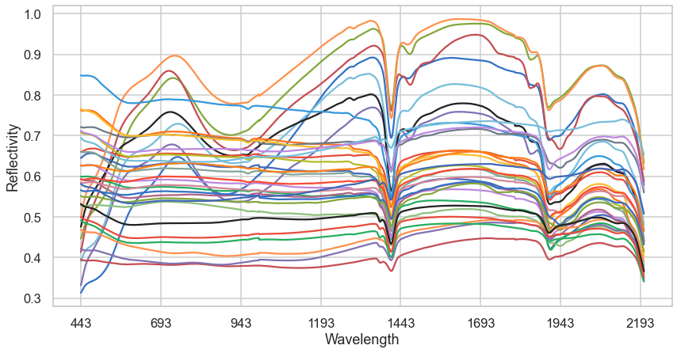
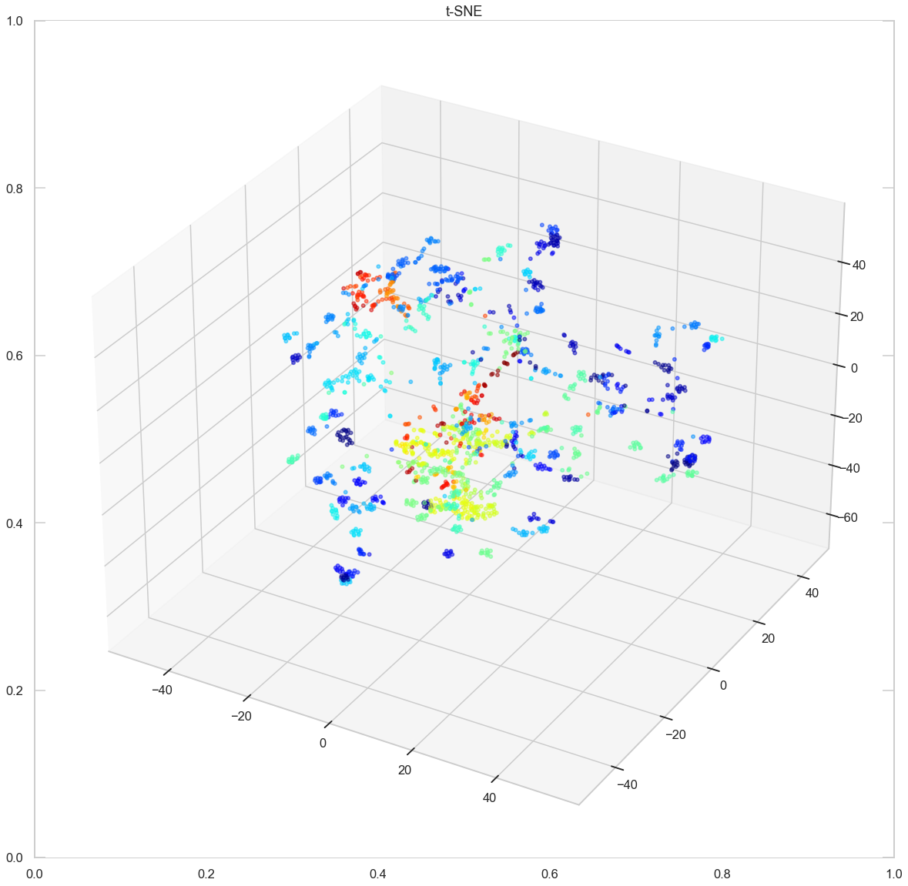

# Dimensionality Reduction

## Jupyter notebooks
- [t- distributed Stochastic Neighbor Embedding](https://github.com/sebastiancoombs/Sebs-Data-Science-Skills/blob/main/Dimensionality%20Reduction/Dimensionality%20Reduction%20-%20t-Stochastic%20Neighbor%20Embedding(try%20with%20smoothed%20data).ipynb)
- [Video Background Removal](https://github.com/sebastiancoombs/Sebs-Data-Science-Skills/blob/main/Dimensionality%20Reduction/Background%20removal%20from%20a%20video%20using%20an%20svd.ipynb)
- [Multi Dimensional Scaling](https://github.com/sebastiancoombs/Sebs-Data-Science-Skills/blob/main/Dimensionality%20Reduction/Multi%20Dimensional%20Scaling.ipynb)

