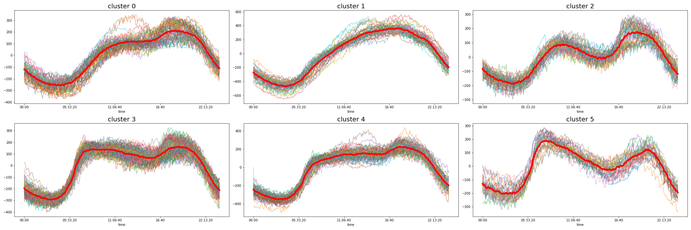

# Sebs Data Science Skills
 Sebastian Coombs's Data Science projects

This is the GitHub repository of Sebastian Coombs' Data Science projects:
## Contents:

- [Deep Learning (for Natural Language Processing, Image Classification and Computer Vision)](https://github.com/sebastiancoombs/Sebs-Data-Science-Skills/tree/main/Deep%20Learning)
- [Recommender Systems](https://github.com/sebastiancoombs/Sebs-Data-Science-Skills/tree/main/Recomender%20Systems)
- [Trees, Ensemble Methods and Random Forests](https://github.com/sebastiancoombs/Sebs-Data-Science-Skills/tree/main/Random%20Forests)
- [Naive Bayes and Text Classification](https://github.com/sebastiancoombs/Sebs-Data-Science-Skills/tree/main/Text%20Classification)
- [Clustering and Segmentation](https://github.com/sebastiancoombs/Sebs-Data-Science-Skills/tree/main/Clustering)
- [Classification Algorithms](https://github.com/sebastiancoombs/Sebs-Data-Science-Skills/tree/main/Classification)
- [Regression](https://github.com/sebastiancoombs/Sebs-Data-Science-Skills/tree/main/Regression)
- [Data Manipulation and Data Visualization](https://github.com/sebastiancoombs/Sebs-Data-Science-Skills/tree/main/Simple%20plotting%20and%20Data%20Manipulation)
