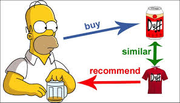

# Recommender Systems

## Jupyter notebooks

- [Book Recommender](https://github.com/sebastiancoombs/Sebs-Data-Science-Skills/blob/main/Recomender%20Systems/Book%20Recommendations.ipynb)
- [Item based Recommendations](https://github.com/sebastiancoombs/Sebs-Data-Science-Skills/blob/main/Recomender%20Systems/Item-Based%20Recommendation.ipynb)
- [Joke Recommendations](https://github.com/sebastiancoombs/Sebs-Data-Science-Skills/blob/main/Recomender%20Systems/Joke%20Recommendations.ipynb)
- [Matrix Factorizations recommendation](https://github.com/sebastiancoombs/Sebs-Data-Science-Skills/blob/main/Recomender%20Systems/Matrix%20Factorizations%20recommendation%20models.ipynb)
- [User-Based Recommendations](https://github.com/sebastiancoombs/Sebs-Data-Science-Skills/blob/main/Recomender%20Systems/User-Based%20Recommendations.ipynb)
