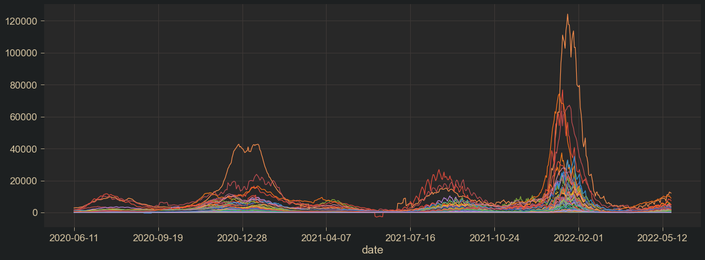

# Regression

                                                    
## Jupyter notebooks
- [Forecasting weekly covid deaths.ipynb](https://github.com/sebastiancoombs/Sebs-Data-Science-Skills/blob/main/Regression/Forecasting%20weekly%20covid%20deaths.ipynb)
- [Image Recognition Leukemia Diagnosis.ipynb](https://github.com/sebastiancoombs/Sebs-Data-Science-Skills/blob/main/Regression/Image%20Recognition%20Leukemia%20Diagnosis.ipynb)
- [New York City energy Regression.ipynb](https://github.com/sebastiancoombs/Sebs-Data-Science-Skills/blob/main/Regression/New%20York%20City%20energy%20Regression.ipynb)
- [Predicting Bird baths in Australia.ipynb](https://github.com/sebastiancoombs/Sebs-Data-Science-Skills/blob/main/Regression/Predicting%20Bird%20baths%20in%20Australia.ipynb)
- [Predicting House Prices sklearn.ipynb](https://github.com/sebastiancoombs/Sebs-Data-Science-Skills/blob/main/Regression/Predicting%20House%20Prices%20sklearn.ipynb)
- [breakfast rating predicitons.ipynb](https://github.com/sebastiancoombs/Sebs-Data-Science-Skills/blob/main/Regression/breakfast%20rating%20predicitons.ipynb)
- [k-nearest neighbor regressor.ipynb](https://github.com/sebastiancoombs/Sebs-Data-Science-Skills/blob/main/Regression/k-nearest%20neighbor%20regressor.ipynb)
