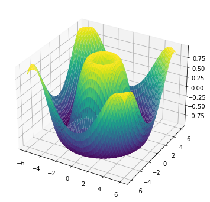
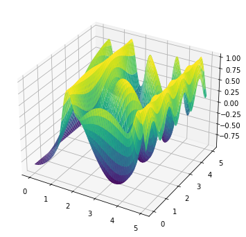
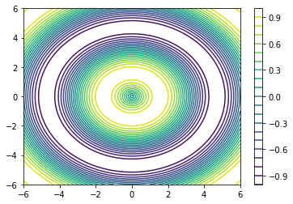

# Data Cleaning and Plotting

## Jupyter notebooks
- [Analyzing law enforcement stops](https://github.com/sebastiancoombs/Sebs-Data-Science-Skills/blob/main/Simple%20plotting%20and%20Data%20Manipulation/Analyzing%20law%20enforcement%20stops.ipynb)
- [A visual history of Nobel prize winners](https://github.com/sebastiancoombs/Sebs-Data-Science-Skills/blob/main/Simple%20plotting%20and%20Data%20Manipulation/Visual%20history%20of%20Nobel%20prize%20winners.ipynb)
- [Contour Plots](https://github.com/sebastiancoombs/Sebs-Data-Science-Skills/blob/main/Simple%20plotting%20and%20Data%20Manipulation/Contour%20plotting.ipynb)
- [Simple plotting](https://github.com/sebastiancoombs/Sebs-Data-Science-Skills/blob/main/Simple%20plotting%20and%20Data%20Manipulation/Plots.ipynb)

- [Gaussian Mixture Plotting](https://github.com/sebastiancoombs/Sebs-Data-Science-Skills/blob/main/Simple%20plotting%20and%20Data%20Manipulation/gaussian%20mixture%20Plotting.ipynb)
